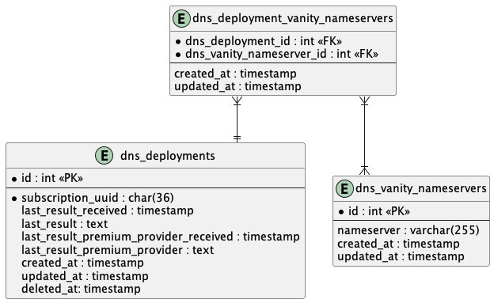

# Premium DNS technical documentation

In addition to regular DNS subscriptions, we also have Premium DNS subscriptions within our system. In essence, Premium DNS ensures a better distribution of DNS servers and therefore better protection against, for example, DDOS attacks.
Premium DNS is not a replacement for regular DNS provisioning, but rather an extension.

## Index
- [How it works](#how-it-works)
  - [How does PremiumDNS differ from regular DNS provisioning?](#how-does-premiumdns-differ-from-regular-dns-provisioning)
- [Vanity Nameservers](#vanity-nameservers)
  - [Vanity Nameservers DB Storage](#vanity-nameservers-db-storage)
  - [Vanity Nameservers Assignment](#vanity-nameservers-assignment)
- [Requirements](#requirements)
- [F.A.Q](#faq)

## How it works
When ordering, the customer has the option to choose Premium DNS or later upgrade the regular DNS to PremiumDNS.
To make this possible we use the product spec `dns.is_premium` from src/Domain/Products/Enums/ProductSpecName.php
```php
ProductSpecName::DNS_IS_PREMIUM
```

When a customer wants to cancel just their Premium DNS (not the parent), a termination is not performed as we expect with other products, but the subscription is downgraded to a regular DNS subscription.

> :warning: If the product spec has not been added or has a value of '0', the PremiumDNS flow will not be executed,
  resulting in a domain not being propagated to Gandi.

## How do we determine if the spec has been set?
In the DnsProductspecRepository (`src/Domain/DNS/Repository/DnsProductSpecRepository.php`) we find the functionality to determine whether a spec is set.
More general information about Product Specs can be found under the [Product Specs](../../Products/Productspecs/README.md) section.

### How does PremiumDNS differ from regular DNS provisioning?
For Premium DNS we do not just create a zone - as we do for regular DNS. We also make some additional calls to PDNS in preparation for an [AXFR](#what-is-axfr) request executed by Gandi.
Process-wise we can identify the next steps in the premium DNS provisioning flow.

- createZone -> This is a shared call in the sense that it is also performed for regular DNS.
- createMetadata -> This serves as preparation and as whitelisting for communication between the Gandi & CLDIN servers.
- updateLiveDns -> This sets the account type to LiveDns.
- sendNotify -> Notify Gandhi that there has been a change in the zone and that an AXFR may be performed. (Note that this is also essential for changes)
  - sendNotifyBypass -> Notify CLDIN that a dns notify has been made so they can bypass their PowerDNS Queue and notify Gandi directly. See [SWD-8387](https://yh-jira.atlassian.net/browse/SWD-8387)


After we have sent the notify, we use the [Gandi LiveDNS API](https://api.sandbox.gandi.net/docs/livedns/) to check whether the zone has actually arrived.
(see [GandiClient](../../../Infra/GandiClient/README.md))

A second important difference is the use of [Vanity Nameservers](#vanity-nameservers).

## Vanity Nameservers
Vanity name servers allow us to re-brand authoritative name servers, so that we can use name servers from the different business units.
In practice, this means that we find a name server such as ns99.sandbox.yourhost.ing in the WHOIS information, for example. But the name server underwater points to a Gandi name server.
To properly arrange the redirection, we use [Glue records](https://docs.gandi.net/en/domain_names/advanced_users/glue_records.html#glue-records) that actually bind the Vanity name to the actual name server.

### Vanity Nameservers DB Storage
Vanity nameservers are stored in the database with a relation to `dns_deployments`. See the following ERD.<br>


### Vanity Nameservers Assignment
For premium DNS, three different name servers are always assigned during creation according to the format `ns<1,253>.hostname.tld`.
Under the Requirements heading we see that 3 TLDs must always be available from the .env. And by tld in this context we mean the part after the identifier. So in this example `sandbox.yourhost.ing`
The identifier part is created from the [VanityNameserverGenerator](../../../../src/Domain/DNS/Generators/VanityNameserverGenerator.php).
In this generator we use a hash (adler32) calculation based on domain. This means that a specific domain is always assigned the same name servers. Please note that this does not mean that the name servers are unique, as multiple domains can be assigned the same name server.

## Requirements
To make things work we need the following `.env` variables

* `GANDI_URL` -> This is the url to the Gandi LiveDNS API
* `GANDI_TOKEN` -> This is the Gandi auth token, this can be created in the Gandi account, when needed
* `GANDI_VERIFY_SSL` -> Should use a secure https connection? true or false
* `GANDI_LIVE_DNS_USE_IPV6` -> Should use IPV6 ? true or false
* `GANDI_LIVE_DNS_IPV4` -> A IPV4 Address received from Gandi
* `GANDI_LIVE_DNS_IPV6` -> A IPV6 Address received from Gandi<
* `GANDI_VANITY_NS1` -> Vanity TLD, received from BU
* `GANDI_VANITY_NS2` -> Vanity TLD, received from BU
* `GANDI_VANITY_NS3` -> Vanity TLD, received from BU

## F.A.Q

### What is AXFR?
DNS zone transfers using the AXFR protocol are the simplest mechanism to replicate DNS records across DNS servers.
To avoid the need to edit information on multiple DNS servers, you can edit information on one server and
use AXFR to copy information to other servers.


> :warning: If there are recurring questions and you know the solution or answer, feel free to extend the F.A.Q section
