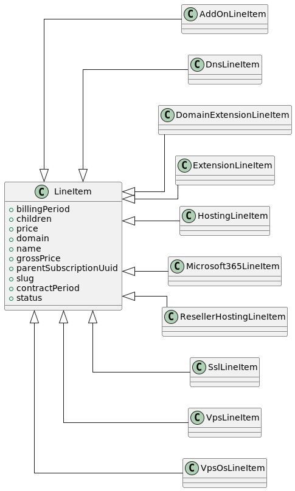

# Order technical documentation

Orders are generated when customers order products on the Sandwave platform, typically through Atlantis. An order consists of any number of order lines, each representing one product to be delivered. Orders need to be stored, processed into subscriptions and eventually into invoice lines.

## Cart orders
The [`OrderService`](../../../src/Domain/Orders/Services/OrderService.php) main function is to process given cart orders from Atlantis to an [`Order`](../../../src/Domain/Orders/Models/Order.php) with attached [`OrderLineItem`](../../../src/Domain/Orders/Models/OrderLineItem.php) in the database.

This is done **after** validation by the [`StoreRequest`](../../../Waterfront/Apps/API/Waterfront/Requests/Order/StoreRequest.php).
The [`OrderService`](../../../src/Domain/Orders/Services/OrderService.php) assumes it is processing validated data.

After the json received from Atlantis is validated it will be denormalized using Symfony's deserialization created by the
[`CartSerializerFactory`](../../../src/Domain/Orders/Serializers/CartSerializerFactory.php).
All properties in the json will be mapped to objects found in the [`DTO`](../../../src/Domain/Orders/DTO) folder of the domain.

The [`OrderService`](../../../src/Domain/Orders/Services/OrderService.php) will handle the following actions based on the given DTO:
1. Resolve the customer
2. Create the `Order` in the database
3. Loop over the ordered subscriptions and create matching `OrderLineItem` in the database ([more info](#orderlineitem-creation)).
4. Apply vouchers
5. Enable the newsletter if applicable
6. Dispatch an [`OrderCreated`](../../../app/Events/OrderCreated.php) event with the new `Order`.


### Atlantis order
Example of an Atlantis cart order with a child. More can be found as [test data](../../../tests/Domain/Orders/Serializers/data).

```json
{
    "customer_id": 1,
    "payment_method": "ideal",
    "subscriptions": {
        "extension": [],
        "hosting": [],
        "ssl": [],
        "vps": [
            {
                "slug": "vps-32-red",
                "name": "VPS 32 Redundant",
                "billing_period": 12,
                "contract_period": 12,
                "period": 12,
                "price": 96,
                "gross_price": 96,
                "status": "registration",
                "children": {
                    "cloudstack-os": [
                        {
                            "status": "registration",
                            "domain": "",
                            "billing_period": 1,
                            "contract_period": 1,
                            "price": 0,
                            "gross_price": 0,
                            "name": "Ubuntu LTS 20.04",
                            "slug": "ubuntu-lts-20.04"
                        }
                    ]
                }
            }
        ],
        "reseller-hosting": [],
        "add-on": []
    },
    "vouchers": [
        {
            "code": "A_VOUCHER_CODE",
            "amount": 100
        }
    ],
    "newsletter": true
}

```

## OrderLineItem Creation

A default [`LineItemCreator`](../../../src/Domain/Orders/LineItemCreators/LineItemCreator.php) is used for every [Cart Order Line](../../../src/Domain/Orders/DTO/CartOrderLines) within the subscriptions.
This creator is being used by default for every subscription order given by Atlantis.

`CartOrderLines` DTO's are split per available product group in Waterfront and extend a single abstract [`LineItem`](../../../src/Domain/Orders/DTO/CartOrderLines/LineItem.php) class.


### Children
Each [`LineItem`](../../../src/Domain/Orders/DTO/CartOrderLines/LineItem.php) can have a children key available which is represented by the [`CartOrderSubscription`](../../../src/Domain/Orders/DTO/CartOrderSubscription.php) DTO.
This means that any type of product can have any product type as a child.

Any given product in the `children` array will be recursively parsed by the [`OrderService`](../../../src/Domain/Orders/Services/OrderService.php) and will create the [`OrderLineItem`](../../../src/Domain/Orders/Models/OrderLineItem.php) and set the correct parent [`OrderLineItem`](../../../src/Domain/Orders/Models/OrderLineItem.php) relation.

The `OrderLineItem` will have a `parent_id` with the id of the parent `OrderLineItem`. If the `parent_id` is present it will find the attached parent `subscription` and attach the new child `subscription` to it.

For Microsoft365 it will use the `parent_subscription_uuid` instead of `parent_id` and not both. Each child `OrderLineItem` will have a reference to the subscription uuid of the parent `subscription`.

#### Validation
The existing validation can be used to enforce certain rules, e.g. a `VpsLineItem` can only have `VpsOs` products as children as seen in the following validation rules:

```php
[
    'subscriptions.vps.*.children'      => ['required', 'array:vpsOs',],
    'subscriptions.vps.*.children.*.*' => ['required', 'array', new ProductPriceRule(customerResolver: $this->customerResolver, priceResolver: $this->priceResolver),
]
```

This validation also makes the `vpsOs` item mandatory for the Vps products. A VPS can only be ordered if a VpsOs as child is given.
For more information see the [Laravel validation rules](https://laravel.com/docs/master/validation#available-validation-rules).
