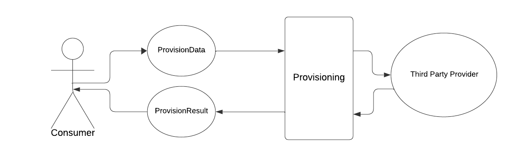

# Provision Domain
Documentation about the Provision domain.

## Consumer
In this domain's documentation there are multiple references to the 'consumer'.
We see the provision domain as a separate concern for our application.
This means that we don't (nor should) care what domain wants to provision something.
We create the ability for them to be able to present us with the correct data to dispatch a provisioning action/request, may this be a new provisioning or deleting an existing one.

This entry point to present us with the correct data is what a 'consumer' will provide to us. The consumer will then receive a provision result object containing the data, status and validation for the initial provision request.


<p style="text-align:center; font-weight: bold">High overview of provisioning from a consumer</p>

The ProvisionData in this overview is highly versatile and can be filled in many different ways depending on the type of provisioning we want to do.
With the following overview we will be able to let our consumer execute different type of provisioning actions with simple requests:

```php
$request = new HostingCreateRequest(
    servicePlan: 'plan1',
    email: 'test@user.com',
    context: $contextUuid,
);

$provisionResult = $this->provisionGateway->request($request);

// ProvisionResultInterface
$ssoRequest = new HostingSsoRequest(
    username: 'user123',
    context: $contextUuid,
);

$ssoResult = $this->provisionGateway->request($ssoRequest);
```

## ProvisionGateway

The `ProvisionGateway` is the single entry point for all provisioning operations. Consumers interact exclusively through this gateway.

It exposes two public methods:

- `request(ProvisionRequestInterface $provisionData): ProvisionResultInterface` -- Dispatches a provision request. Internally it resolves the correct type service via the `ProvisionServiceFactory`, stores the request for traceability, validates if required, and delegates to the provider. Returns a `ProvisionResultInterface` containing the status, data, and any validation errors or exceptions.
- `fetch(ProvisioningResultQueryFilters $filters, ?int $limit): Collection` -- Retrieves historical provisioning results with filtering support (by UUID, tag, status, date range, request type, etc.).

## States
States are the different states a provision can be in. The available states can be found in the `ProvisionStatus` enum.

The available states are:

| State              | Description                                  |
|--------------------|----------------------------------------------|
| `PENDING`          | Request has been submitted, awaiting result   |
| `SUCCESS`          | Provisioning completed successfully           |
| `FAILED`           | Provisioning failed                           |
| `VALIDATION_ERROR` | Request failed validation before dispatching  |
| `RETRYING`         | Retrying provision internally                 |
| `DELETING`         | Termination in progress                       |
| `DELETED`          | Resource successfully deleted                 |
| `DELETION_FAILED`  | Termination failed                            |

A state diagram has been created and can be found in [ProvisionStates.plantuml](States/ProvisionStates.plantuml). This diagram shows the different states and the possible transitions between them.

## Layered Architecture

The Provision domain uses a layered architecture with inheritance. The domain is divided into the following layers:
- Provision
- Provision Types
- Provision Providers
- Provision Clients

### Diagrams

- [Abstract layers diagram](Architecture/abstract-layers.plantuml) for the existing layered layout
- [Provision layers diagram](Architecture/provision-layers.plantuml) for all our existing types, providers and clients
- [Hosting layers diagram](Architecture/hosting-layers.plantuml) for type specific example with validators and services.

### Provision
Initial entry points for [consumers](#consumer). This layer is responsible for the orchestration of the provisioning process.
It will check which [type](#types) is needed for the given `ProvisionRequest` and will use its factory to call the correct type service.

It will return a `ProvisionResult` object containing the data, status and validation for the initial provision request which the consumer can use to act upon.

### Types

Provision types are the different types of provisions that can be made or updated.
The available types can be found in the `ProvisionType` enum:

| Type                   | Value                  | Description                                   |
|------------------------|------------------------|-----------------------------------------------|
| `HOSTING`              | `hosting`              | Web hosting (Plesk, DirectAdmin)              |
| `RESELLER_HOSTING`     | `reseller_hosting`     | Reseller hosting accounts                     |
| `REDIRECT`             | `redirect`             | URL redirects (Caddy)                         |
| `VPS`                  | `vps`                  | Virtual Private Servers                       |
| `DNS`                  | `dns`                  | DNS provisioning and validation               |
| `M365`                 | `microsoft365`         | Microsoft 365 domain management               |
| `SSL`                  | `ssl`                  | SSL certificates                              |
| `DOMAIN_NAME`          | `domain_name`          | Domain name registration                      |
| `DOMAIN_NAME_COUPLING` | `domain_name_coupling` | Coupling domains to deployments               |
| `SITEBUILDER`          | `sitebuilder`          | Website builder (BaseKit)                     |
| `BACKUP`               | `backup`               | Backup services (Acronis)                     |

The type domain is responsible for the validation of the provision request (for instance, a `getSso` request for hosting should contain a username).

A type should register itself in the `ProvisionServiceFactory` and implement a `AbstractProvisionService` with a `ProvisionServiceFactoryInterface` to retrieve the correct provider service and validators for each request.

Currently registered types in `ProvisionServiceFactory`:
- `HOSTING` -> `HostingProvisionService`
- `M365` -> `Microsoft365ProvisionService`
- `DOMAIN_NAME_COUPLING` -> `DomainNameCoupleService`
- `SITEBUILDER` -> `SitebuilderProvisionService`
- `BACKUP` -> `BackupProvisionService`
- `REDIRECT` -> `RedirectProvisionService`

Once validated the request will be dispatched to the correct provider. This can be a default provider set on the type service or a provider given in the `ProvisionRequest` by the [consumer](#consumer).

Each type can have multiple [provider](#providers) implementations.

### Providers
Providers are the different providers that can be used to provision a certain type of provision.
The available providers can be found in the `ProvisionProvider` enum:

| Provider             | Value                 | Used By              |
|----------------------|-----------------------|----------------------|
| `PLESK`              | `plesk`               | Hosting              |
| `DIRECTADMIN`        | `directadmin`         | Hosting              |
| `RTR`                | `realtimeregister`    | Domain Names         |
| `OPENPROVIDER`       | `openprovider`        | Domain Names         |
| `GANDI`              | `gandi`               | Domain Names         |
| `MICROSOFT_ONLINE`   | `microsoft_online`    | M365                 |
| `MICROSOFT_GRAPH`    | `microsoft_graph`     | M365                 |
| `MICROSOFT_IRMA`     | `microsoft_irma`      | M365                 |
| `CLOUDSTACK`         | `cloudstack`          | VPS                  |
| `POWERDNS`           | `powerdns`            | DNS                  |
| `BASEKIT`            | `basekit`             | Sitebuilder          |
| `ACRONIS`            | `acronis`             | Backup               |
| `CADDY`              | `caddy`               | Redirects            |
| `INTERNAL`           | `internal`            | Domain Name Coupling |

Providers are responsible for the actual provisioning of a resource using a matching client.
Two examples would be:

1. A `DirectAdminProvisionService` will provision hosting to DirectAdmin using the `DirectAdminClient`
2. An `AcronisProvisionService` will provision backups to Acronis using the `AcronisClient`

Providers should implement the interfaces given by the type service and
should be registered in the implementation of the type specific `ProvisionServiceFactoryInterface` to be able to be retrieved by the type service.

### Clients
Clients are the actual clients that will communicate with the external services to provision the resource.
They don't actually live in the Provision domain but are retrieved from the `Infra` domain.

## Type Documentation

- [Hosting](Hosting/Hosting.md) -- Web hosting provisioning (Plesk, DirectAdmin)
- [Redirects](Redirects/Redirects.md) -- URL redirect provisioning (Caddy)
- [Sitebuilder](Sitebuilder/Sitebuilder.md) -- Website builder provisioning (BaseKit)
- [Microsoft 365](Microsoft365/Microsoft365.md) -- Microsoft 365 domain management
- [Backup](Backup/Backup.md) -- Backup provisioning (Acronis)
- [DNS](DNS/DNS.md) -- DNS provisioning and validation
- [Domain Name Coupling](DomainNames/Coupling/DomainNameCoupling.md) -- Coupling domains to deployments

## Cross-cutting Concerns

- [Mask Request Properties](Requests/MaskRequestProperties.md) -- Masking sensitive data in stored requests
- [Tags](Requests/Tags.md) -- Tagging system for provision requests
- [Context UUIDs](Requests/ContextUuids.md) -- Linking deployments to the same context
