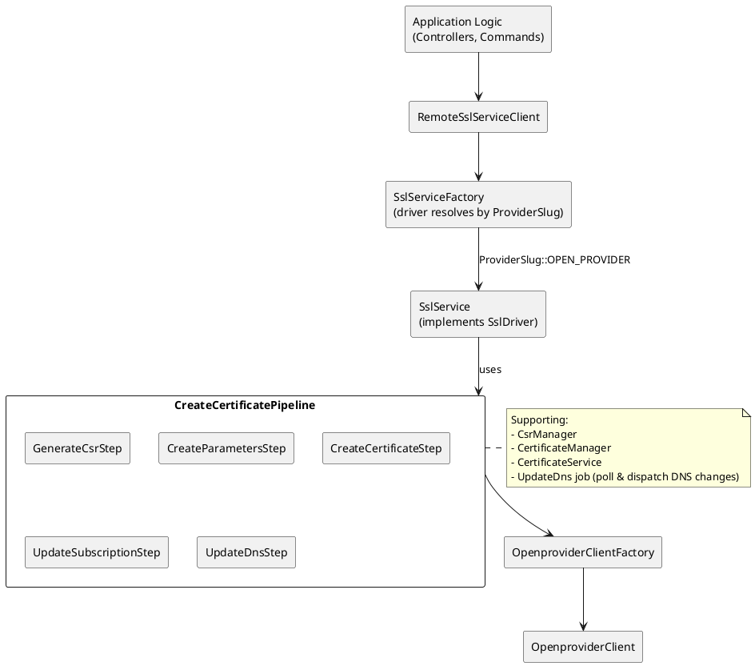
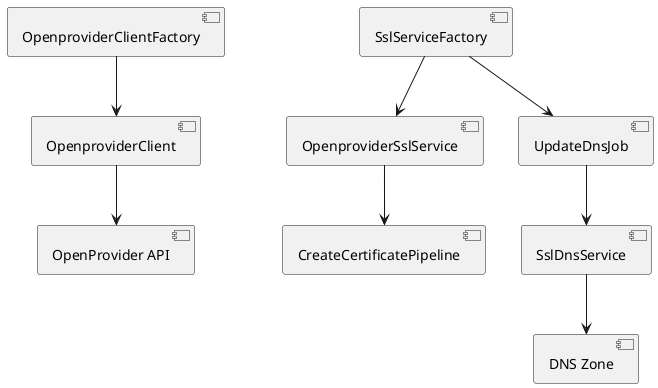
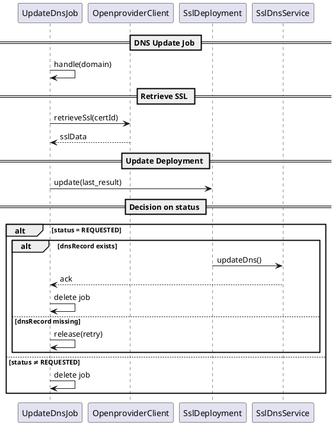

# OpenProvider SSL

### Overview

1. **Domain Models**
	- **`SslDeployment`**: Tracks provisioning state for a subscription.
	- **`Result`**: Encapsulates remote SSL service responses.

2. **Client Facade**
	- **`RemoteSslServiceClient`**: Central entry point; selects the OpenProvider driver and wraps calls in logging and exception-to-`Result` translation.

3. **Factory**
	- **`SslServiceFactory`**: Returns the correct `SslDriverInterface` implementation (OpenProvider, RTR, or placeholder) per the subscription’s provider slug.

4. **Driver**
	- **`SslService`** (`Waterfront\Domain\Ssl\Services\SslService`): Implements the OpenProvider flows—create, retrieve, reissue, renew, prepare certificates, and validation—via an injected `OpenproviderClientFactory` and accompanying pipeline.

5. **Pipeline**
	- **`CreateCertificatePipeline`**: Orchestrates CSR generation, parameter creation, certificate ordering, subscription record update, and DNS validation orchestration via `UpdateDnsStep`.

6. **Supporting Services**
	- **`CsrManager`**
	- **`CertificateManager`**
	- **`CertificateService`**
	- **`CreateParametersStep`**
	- **`CreateCertificateStep`**
	- **`UpdateDnsStep`**
	- **`OpenproviderClientFactory`**
	- **`UpdateDns`** job

7. **Configuration & Storage**
	- **Environment**: API credentials in `OpenproviderProviderCredentials` (model).
	- **Storage**: CSRs & keys in KeyCloud/LocalDisk; certificates in CertificateCloud; Eloquent for `SslDeployment`.

8. **Error Handling & Retries**
	- Centralized `try/catch` in `RemoteSslServiceClient` → `Result::STATUS_ERROR`.
	- `CreateCertificatePipeline` dispatches `UpdateDns` job to poll EV/DCV statuses with hourly retry (168 tries).
	- Driver-level exceptions (`LogicException`, `RuntimeException`) bubble to client and are logged.

----------

### Architecture



----------


### OpenProvider SSL end-to-end interactions

This section dives into the end-to-end data flows for the OpenProvider driver—i.e. the sequence of interactions between classes, services, and external APIs during **create**, **retrieve**, **reissue**, and **renew** operations.


----------

### 1. Create Certificate

```
Application

↓ create(period, deployment, ?csr)
RemoteSslServiceClient::create()
↓
SslServiceFactory::driver(OPEN_PROVIDER)
↓
SslService::create(productSpec, …)
↓
CreateCertificatePipeline::process()
├─ GenerateCsrStep::execute() or CsrManager::storeUserSupplied()
├─ CreateParametersStep::execute() → Parameters
├─ CreateCertificateStep::execute() → OpenproviderClient::orderSsl()
├─ UpdateSubscriptionStep::execute() → SslDeployment record
└─ dnsChecker():
├─ if DV → UpdateDnsStep::execute()
└─ else EV → dispatch UpdateDns job (hourly retries)
↑
Result (requestId, status)
↑
RemoteSslServiceClient.create() returns Result
```

**Step-by-Step**
1. **Entry & Validation**
	- `RemoteSslServiceClient::create($period, $sslDeployment, $csr)`
	- Throws if `request_id` already set.

2. **Fetch Product Specification**
	- `$productSpec = $sslDeployment->subscription->product->productSpecs()->where('name','=','ssl.product_id')->firstOrFail()`

3. **Driver Invocation**
	- `SslServiceFactory::driver($providerSlug)->create(...)`

4. **CSR Generation / Storage**
	- If `$csr` provided → `CsrManager::storeUserSupplied($csr, $domain)`.
	- Else → `GenerateCsrStep::execute(...)`

	- Internally calls `CsrManager::create()` to generate private key + CSR, store to KeyCloud & LocalDisk.

5. **Build Order Parameters**
	- `CreateParametersStep::execute($sslProduct, $period, $sslDomain, $customerData, $csrKey)`
	- Produces a `Parameters` object containing:
		- `domain`, `csr`, `productId`, `period`, `customer` data, etc.

6. **Order Certificate**
	- `CreateCertificateStep::execute($parameters)`
	- Delegates to `OpenproviderClient->orderSsl(Parameters)`
	- Returns a `Result` with:
	- `requestId`, `certificateStatus` (“waiting”), optional `dnsRecord` & `dnsValue`.

7. **Persist Deployment**
	- `UpdateSubscriptionStep::execute($result, $subscriptionUuid, $customCsr)`
	- Creates/updates `SslDeployment`:
		- `request_id`, `certificate_id`, `last_result`, `last_result_received`, `custom_csr`

8. **DNS Validation**
	- `CreateCertificatePipeline::dnsChecker($result, $domain)`
	- **DV** (has `dnsValue`): `UpdateDnsStep::execute($result, $domain)` applies CNAME immediately.
	- **EV**: dispatches `UpdateDns($domain)` job (tries=168, retry=3600s) to poll via `OpenproviderClient->retrieveSsl()`.

9. **Return Result**
	- A `Result` DTO with `status = waiting|ok`, `requestId`, and any DNS instructions.


**Classes & Responsibilities**

| Class                     | Responsibility                                                                |
|---------------------------|-------------------------------------------------------------------------------|
| `RemoteSslServiceClient`  | Entry point; catches exceptions → `Result::STATUS_ERROR`.                     |
| `SslServiceFactory`       | Resolves `OpenproviderSslService`.                                            |
| `OpenproviderSslService`  | Implements `create()`; delegates to pipeline.                                 |
| `CreateCertificatePipeline` | Orchestrates CSR generation, parameters, order, subscription update, DNS.   |
| `GenerateCsrStep`         | Generates CSR via `CsrManager`.                                               |
| `CreateParametersStep`    | Constructs `Parameters` for API call.                                         |
| `CreateCertificateStep`   | Calls `OpenproviderClient->orderSsl()`.                                       |
| `UpdateSubscriptionStep`  | Persists `SslDeployment` state.                                               |
| `UpdateDnsStep`           | Applies DNS changes via `SslDnsService`.                                      |
| `CsrManager`              | CSR/private-key management.                                                   |
| `OpenproviderClient`      | Low-level HTTP calls to OpenProvider API.                                     |
| `UpdateDns (job)`         | Polls EV status and applies DNS when ready.                                   |


----------


#### 2. Retrieve Certificate

```text
Application
↓ retrieve(sslDeployment)
RemoteSslServiceClient.retrieve()
↓
SslServiceFactory.driver(OPEN_PROVIDER)->retrieve()
↓
OpenproviderClient->retrieveSsl(certificate_id)
↳ Result
↑
RemoteSslServiceClient.retrieve() returns Result

```


**Step-by-Step**
1. **Entry**
	- `RemoteSslServiceClient::retrieve($sslDeployment)`.

2. **Driver Invocation**
	- `SslServiceFactory::driver(...)->retrieve($sslDeployment)`

3. **Validation**
	- Throws `LogicException` if `certificate_id` is `null`.

4. **API Call**
	- `OpenproviderClient->retrieveSsl($certificate_id)`
	- Wraps response into a `Result`:
		- `status = ok|error`, `certificateStatus`, `dnsRecord`, `dnsValue`, full `responseData`.

5. **Return**
	- Returns the `Result` to caller.


**Classes & Responsibilities**

| Class               | Responsibility                                  |
|---------------------|--------------------------------------------------|
| `SslService`        | Implements `retrieve()`.                         |
| `OpenproviderClient`| Low-level `retrieveSsl()` HTTP request.          |
| `Result`            | DTO for response and status mapping.             |

----------

#### 3. Reissue Certificate

```text
Application
↓ reissue(sslDeployment, csr)
RemoteSslServiceClient.reissue()
↓
SslServiceFactory.driver()->reissue(customerData, sslDeployment, csr)
↓
OpenproviderSslService->reissue()
├─ build Parameters (with new CSR)
├─ OpenproviderClient->reissueSsl(certificate_id, Parameters)
├─ dispatch UpdateDns job (non-recursive)
└─ Artisan::call(CheckSsl)
↳ Result
↑
RemoteSslServiceClient.reissue() returns Result

```

**Step-by-Step**
1. **Entry & Logging**
	- `RemoteSslServiceClient::reissue($sslDeployment, $csr)` logs intent.

2. **Driver Call**
	- Delegates to `SslService::reissue($customerData, $sslDeployment, $csr)`.

3. **Parameter Construction**
	- `Parameters::create([... 'csr' => $csr, 'domain'=>…])`.

4. **API Call**
	- `OpenproviderClient->reissueSsl($certificate_id, $parameters)`.

5. **DNS Job Dispatch**
	- Enqueues `new UpdateDns($domain, false)` on `sync` connection.

6. **Immediate Sanity Check**
	- `Artisan::call(CheckSsl, ['domain'=>$domain])`.

7. **Result Return**
	- Returns `Result` from `reissueSsl()`.


**Classes & Responsibilities**

| Class                  | Responsibility                                                   |
|------------------------|------------------------------------------------------------------|
| `RemoteSslServiceClient` | Wraps exceptions → `Result::STATUS_ERROR`.                      |
| `SslService`           | Implements `reissue()`: prepares parameters, API call, dispatches jobs. |
| `OpenproviderClient`   | Executes `reissueSsl()` HTTP request.                            |
| `UpdateDns` (job)      | Polls for DNS record if EV, applies CNAME.                       |
| `CheckSsl` (console cmd)| Performs post-reissue validation.                                |


----------

#### 4. Renew Certificate

```text
Application
↓ renew(sslDeployment)
RemoteSslServiceClient.renew()
↓
SslServiceFactory.driver()->renew(sslDeployment)
↓
OpenproviderSslService.renew()
├─ retrieveSsl(certificate_id) → refresh last_result
├─ renewSsl(certificate_id)
├─ dispatch UpdateDns job
└─ return Result
↑
RemoteSslServiceClient.renew() returns Result

```


**Step-by-Step**
1. **Entry & Logging**
	- `RemoteSslServiceClient::renew($sslDeployment)` logs intent.

2. **Driver Invocation**
	- Calls `SslService::renew($sslDeployment)` inside `try/catch`.

3. **Pre-Renew Retrieval**
	- `retrieveSsl($certificate_id)` to update `last_result` on `SslDeployment`.

4. **API Call**
	- `OpenproviderClient->renewSsl($certificate_id)` issues renewal.

5. **DNS Job Dispatch**
	- Enqueues `new UpdateDns($domain, false)` for DCV/E validation.

6. **Error Handling**
	- Catches any `Throwable`, wraps in `RuntimeException('Failed to renew…')`.

7. **Return**
	- Returns `Result` from `renewSsl()`.


**Classes & Responsibilities**

| Class                   | Responsibility                                                  |
|-------------------------|-----------------------------------------------------------------|
| `RemoteSslServiceClient`| Catches exceptions → `Result::STATUS_ERROR`.                    |
| `SslService`            | Implements `renew()`: retrieval, API call, job dispatch, error handling. |
| `OpenproviderClient`    | Executes `renewSsl()` HTTP request.                             |
| `UpdateDns` (job)       | Polls and applies DNS record when ready.                        |

----------

### Supporting Services

- **`SslProduct`**: Value object for mapping OpenProvider product IDs to SSL types (regular, wildcard, extended).

- **`CreateCertificatePipeline`**: Implements certificate-order pipeline:
    - **CSR** → `GenerateCsrStep` or store user CSR

    - **Parameters** → `CreateParametersStep`

    - **Order** → `CreateCertificateStep` (via `OpenproviderClient->orderSsl()`)

    - **Subscription** → `UpdateSubscriptionStep` persists `SslDeployment`

    - **DNS** → `UpdateDnsStep` or dispatch `UpdateDns` job for EV

- **`OpenproviderClientFactory`**: Constructs `OpenproviderClient` with credentials, or returns default client.

- **`CertificateService`**:
    - `check(domain, period)`: Validates existing cert’s expiration.
    - `prepareCertificateInstallParameters(domain)`: Fetches CSR / keys / certs to produce install parameters.

- **`CertificateManager`**: Stores & retrieves root/intermediate/main certificates in CertificateCloud.

- **`CsrManager`**: Manages CSR/private-key lifecycle in LocalDisk and KeyCloud.

- **`UpdateDns` Job**: Polls OpenProvider until DNS instructions appear or cert becomes active, retrying hourly (168 tries), then dispatches DNS updates.

- **`UpdateDns` Event**: Carries `DnsZoneDiff` for the DNS subsystem to apply.

----------


## 5. Error Handling & Retries


- **Facade Level**


- All `RemoteSslServiceClient` calls wrap exceptions in `try/catch(Exception)` and return a `Result` with


```php
Result::create([
    'status' => Result::STATUS_ERROR,
    'errorCode' => $exception->getCode(),
    'errorMessage' => $exception->getMessage(),
]);
```


- **Driver Level**
    - `LogicException` for missing `certificate_id`.
    - `RuntimeException` for CSR generation or renew failures.

- **Pipeline Level**
    - Uncaught exceptions during CSR/parameters/order bubble to client.

- **DNS Job (`UpdateDns`)**
    - Retries hourly (`$retry=3600`) up to 168 times (`$tries = 168`), then gives up.
    - On each run, calls `retrieveSsl()`, updates `last_result`, then:
        - If `getDnsRecord() != ''` → applies DNS update and deletes job.
        - Else if still `REQUESTED` → requeues (or deletes if non-recursive).

----------


## 6. DNS Diagrams


### Component Diagram





### Sequence Diagram (DNS Job)




----------


### E. Webhook-Driven Installation


Upon receiving an OpenProvider webhook, `SslWebhookService\Services\SslService::installCertificate()`:


1. **Identify** subscription by commonName domain.


2. **Retrieve** latest via `OpenproviderClient->retrieveSsl()`.


3. **Persist** webhook payload and `last_result`.


4. **Store** certificates via driver’s `prepareCertificates()`.


5. **Validate** CSR-private-key match.


6. **Prepare** install parameters and forward to hosting/sitebuilder drivers.


7. **Update** subscription `technical_status` and trigger `CheckSsl` console command.

----------


## Configuration

| Item                   | Source                                        | Notes                                              |
|------------------------|-----------------------------------------------|----------------------------------------------------|
| **OpenProvider Credentials** | `OpenproviderProviderCredentials` model     | `api_url`, `username`, `password`                  |
| **Default Provider**   | `Provider` table, `default = true`            | Resolved by `SslServiceFactory::defaultDriver`     |
| **CSR Strength**       | `CsrManager::create()` default `2048`         | Overridable via method parameter                   |
| **DNS CNAME TTL**      | Hardcoded `600` in `SslDnsService`            | Can be parameterized if needed                     |
| **Retry Schedule**     | `UpdateDns` job: `tries = 168`, `retry = 3600` (1h) | Covers EV/DCV polling                          |
| **Queues**             | `QueueName::PARTNER_SSL`                      | `UpdateDns` job routed accordingly                 |

----------
