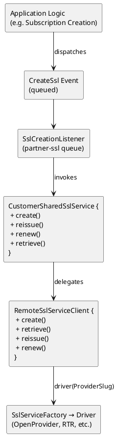

# Partner/Reseller SSL
## Overview

The partner/reseller SSL‐provisioning flow enables queue‐based SSL. The primary components are:

* **Event**: `CreateSsl`—fired when a new SSL deployment should be provisioned.
* **Listener**: `SslCreationListener`—consumes `CreateSsl` events on the `partner-ssl` queue with exponential backoff.
* **Service**: `CustomerSharedSslService`—encapsulates business logic for partner SSL operations, delegates to `RemoteSslServiceClient`, updates subscription state.
* **Client**: `RemoteSslServiceClient`—facade over driver implementations, handles logging and exception→`Result` translation.
* **Driver Layer**: resolved by `SslServiceFactory` (not shown here)—implements protocol‐specific flows.
* **Model**: `Result`—data-transfer object representing API responses.

---

## Architecture

### Component Diagram



---

## Partner SSL Flows

### 1. Create Certificate


```text
CreateSsl Event
  ↓ handle()
SslCreationListener.handle()
  ├─ if no DNS zone → release(backoff)
  └─ CustomerSharedSslService.create(period, deployment, csr)
      ↓
RemoteSslServiceClient.create(period, deployment, csr)
      ↓
Driver.create(...) → Result
      ↑
RemoteSslServiceClient returns Result
      ↓
CustomerSharedSslService:
  ├─ update subscription.technical_status
  └─ return Result
```

#### Step-by-Step

1. **Event Emission**

   * A `CreateSsl` event is dispatched with domain, period, `SslDeployment`, and optional CSR.

2. **Listener Invocation**

   * `SslCreationListener` (on `partner-ssl` queue) logs context.
   * If `hasAlreadyRun()`, it exits early.
   * Verifies DNS zone via `DnsService::hasDnsZone()`.

     * If missing, re-queues itself with backoff.

3. **Shared Service Call**

   * Invokes `CustomerSharedSslService::create()`.
   * Validates user-supplied CSR (if any) via `csrValidate()`.
   * Calls `RemoteSslServiceClient::create()`.

4. **Remote Client & Driver**

   * `RemoteSslServiceClient` selects driver by `provider.slug`.
   * Invokes driver’s `create()` (detailed in driver docs).
   * Catches exceptions, logs, and converts to `Result::STATUS_ERROR`.

5. **Subscription Update**

   * `CustomerSharedSslService` overrides `subscription.technical_status` with `Result::certificateStatus` or `Result::status`.
   * Saves the subscription.

6. **Result Propagation**

   * The `Result` DTO is returned to the listener (not further acted upon in this flow).

---

### 2. Retrieve Certificate

```text
(Some Controller or Service)
  ↓ CustomerSharedSslService.retrieve(deployment)
CustomerSharedSslService.retrieve()
  ↓
RemoteSslServiceClient.retrieve(deployment)
  ↓
Driver.retrieve(deployment) → Result
  ↑
Return Result
```

#### Step-by-Step

1. **Invoke Shared Service**

   * `retrieve()` delegates directly to `RemoteSslServiceClient.retrieve()`.

2. **Remote Client**

   * Calls driver’s `retrieve()` which throws `LogicException` if `certificate_id` is `null`.
   * Returns a populated `Result`.

3. **Return**

   * Passes `Result` back to caller.

---

### 3. Reissue Certificate

```text
(Some Controller or Service)
  ↓ CustomerSharedSslService.reissue(deployment, csr)
CustomerSharedSslService.reissue()
  ↓
RemoteSslServiceClient.reissue(deployment, csr)
  ↓
Driver.reissue(...) → Result
  ↑
CustomerSharedSslService:
  ├─ update subscription.technical_status
  ├─ call CheckSsl artisan command
  ├─ CsrManager.saveCsr(domain, csr)
  ├─ flag deployment.has_reissued
  └─ return Result
```

#### Step-by-Step

1. **Invoke Shared Service**

   * `reissue()` calls `RemoteSslServiceClient.reissue()`.

2. **Remote Client & Driver**

   * Executes driver’s `reissue()`, logs, catches exceptions → `Result`.

3. **Subscription & CSR Update**

   * Updates `subscription.technical_status`.
   * Triggers `php artisan sanity:check-ssl --domain=…`.
   * Persists new CSR via `CsrManager::saveCsr()`.
   * Marks `SslDeployment.has_reissued = true`.

4. **Return**

   * Returns the `Result` DTO.

---

### 4. Renew Certificate

```text
(Some Controller or Service)
  ↓ CustomerSharedSslService.renew(deployment)
CustomerSharedSslService.renew()
  ├─ attempt retrieve() → remoteResult
  ├─ csrExists = csrExistsForDomain(domain)
  ├─ if csrExists && remoteResult.isCertificateActive():
  │     → remoteSslServiceClient.renew(deployment)
  └─ else:
        sslDeployment.request_id = null
        → remoteSslServiceClient.create(contract_period, deployment, null)
```

#### Step-by-Step

1. **Fetch Existing**

   * Attempts `retrieve()`; logs but swallows `LogicException`.

2. **Determine Renewal vs. New Order**

   * Checks local CSR presence via `csrExistsForDomain()`.
   * If CSR exists **and** certificate is active → calls `renew()`.
   * Otherwise → resets `request_id` to `null` and issues a new `create()`.

3. **Remote Client Calls**

   * Both `renew()` and `create()` flow through `RemoteSslServiceClient`, producing a `Result`.

4. **Return**

   * Returns the `Result` DTO.

---

## Class Reference

### `RemoteSslServiceClient`

Facade over driver implementations; handles logging, exception translation.

| Method                                                                                         | Description                                                                                                    |
| ---------------------------------------------------------------------------------------------- | -------------------------------------------------------------------------------------------------------------- |
| `create(int $period, SslDeployment $sslDeployment, ?string $csr): Result`                      | Validates no existing request; logs; calls driver’s `create()`; converts exceptions to `Result::STATUS_ERROR`. |
| `retrieve(SslDeployment $sslDeployment): Result`                                               | Delegates to driver’s `retrieve()`.                                                                            |
| `reissue(SslDeployment $sslDeployment, string $csr): Result`                                   | Logs; calls driver’s `reissue()`; converts exceptions to `Result::STATUS_ERROR`.                               |
| `renew(SslDeployment $sslDeployment): Result`                                                  | Logs; calls driver’s `renew()`; converts exceptions to `Result::STATUS_ERROR`.                                 |
| `csrExistsForDomain(string $domain, ProviderSlug $driver): bool`                               | Delegates to driver’s `csrExistsForDomain()`.                                                                  |
| `csrValidate(string $csr, string $domain, ?SslDeployment $sslDeployment): array\|Result\|bool` | Delegates to driver’s `validate()`, or default driver; converts exceptions to `Result::STATUS_ERROR`.          |

---

## Configuration

| Item                   | Description                                                            | Default / Source                       |
| ---------------------- | ---------------------------------------------------------------------- | -------------------------------------- |
| **Queue Name**         | Queue for create events                                                | `partner-ssl`                          |
| **Listener Retries**   | Number of attempts                                                     | `7`                                    |
| **Backoff Delays**     | Seconds between retries                                                | `[60,300,1800,3600,21600,43200,86400]` |
| **Subscription Flags** | `technical_status`, `has_reissued` fields on Subscription & Deployment | Updated by shared service              |
| **Driver Selection**   | Based on `SslDeployment.provider.slug`                                 | Resolved by `SslServiceFactory`        |
| **CSR Persistence**    | Via `CsrManager` (LocalDisk + KeyCloud)                                | Defaults in DI bindings                |

---

## Error Handling & Retries

* **Listener Backoff**

  * `SslCreationListener` retries up to 7 times with exponential delays.
  * If DNS zone not yet provisioned, listener releases itself back onto the queue.

* **Client Exception Wrapping**

  * `RemoteSslServiceClient` wraps all `Exception` in `try/catch`, logs full trace, and returns a `Result` with `STATUS_ERROR`.

* **CSR Validation**

  * `CustomerSharedSslService::create()` returns a 422‐style error `Result` if CSR format/domain mismatch.

* **Renew Fallback**

  * If `retrieve()` fails or no local CSR is present, `renew()` resets `request_id` and issues a fresh `create()` instead of renewing.

---
