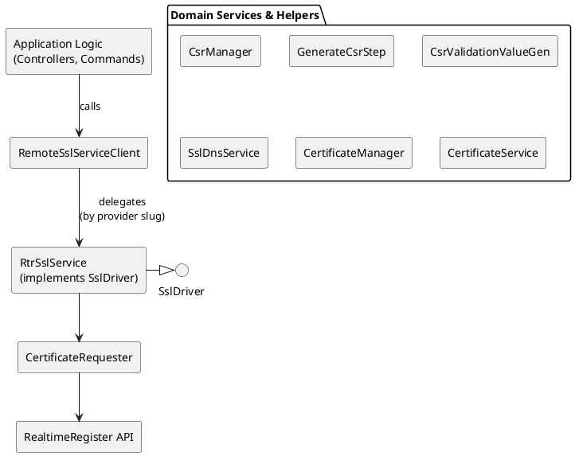

# RTR SSL

### Overview
1. **Domain Models**
	- **`SslDeployment`**: Tracks provisioning state for a subscription.
	- **`Result`**: Encapsulates remote SSL service responses.

2. **Client Facade**
	- **`RemoteSslServiceClient`**: Entry point from application logic; selects the appropriate driver and wraps low-level calls in logging and error handling.

3. **Drivers**
	- **`RtrSslService`**: Implements `SslDriverInterface` against the Realtime Register API (via `CertificateRequester`).
	- **`SslService`**: Implements `SslDriverInterface` against Openprovider (via `OpenproviderClientFactory`).

4. **Supporting Services**
	- **`CsrManager`**, **`GenerateCsrStep`**, **`CsrValidationValueGenerator`**, **`CertificateManager`**, **`CertificateService`**, **`SslDnsService`**, **`UpdateDns`** job.

5. **Persistence & Storage**
	- **Database**: `ssl_subscriptions` table via Eloquent.
	- **Filesystem / Cloud**: CSR & private keys (local disk + KeyCloud).

6. **Configuration**
	- Provider selection via `ProviderType::SSL` + default flag.
	- API credentials/config via `ConfigurationInterface` bindings.

7. **Error Handling & Retries**
	- Try/catch around remote calls, conversion to `Result::STATUS_ERROR`.

----------
### Architecture

#### Component Diagram



---

### RTR SSL end-to-end interactions
This section dives into the end-to-end data flows for the Realtime Register (RTR) driver—i.e. the sequence of interactions between classes, services, and external APIs during **create**, **retrieve**, **reissue**, and **renew** operations.

---

#### 1. Create Certificate

```
Application
↓ RemoteSslServiceClient::create(period, sslDeployment, csr)
SslServiceFactory
↓ driver(ProviderSlug::RTR)
RtrSslService::create(productSpec, period, customerData, sslDeployment, csr)
├─ Logger::info("create")
├─ Assert domain present
├─ SslProduct::fromNative → determine sslDomain (wildcard?)
├─ CSR:
│   ├─ if user supplied: CsrManager::storeUserSupplied(csr, domain)
│   └─ else: GenerateCsrStep::execute(customerData, domain, sslDomain)
├─ RtrSslService::updateDns(domain, csr)
│   ├─ CsrValidationValueGenerator → compute record & value
│   └─ SslDnsService::updateDns(result, registrableDomain)
├─ CertificateRequester::request(customerData, product, period, csr)
│ ↳ RTR API → processId
├─ SslDeployment::update([
│ 'request_id' => processId,
│ 'last_result' => JSON({ process_id, certificate_status }),
│ 'last_result_received' => now(),
│ 'custom_csr' => flag
│ ])
└─ return Result::create([ 'requestId'=>processId, 'status'=>'waiting' ])
```


**Step-by-Step**
1. **Entry & Logging**
	- `RemoteSslServiceClient::create()` logs intent and validates that no prior `request_id` exists.

2. **Driver Selection**
    - `SslServiceFactory::driver('rtr')` instantiates `RtrSslService`.

3. **CSR Handling**
	-  If a CSR is passed, `CsrManager::storeUserSupplied()` writes it to KeyCloud.
	-  Otherwise, `GenerateCsrStep::execute()` calls `CsrManager::create()` to generate key+CSR locally, then syncs to KeyCloud.

4. **DNS Preparation**
    - `RtrSslService::updateDns()` builds CNAME host (`_{md5(csr)}`) and target (`{sha256(csr)}.sectigo.com.`).
	- Calls `SslDnsService::updateDns()`, which:
	- Locates existing CNAME in `DnsService` (via PublicSuffixList).
	- Emits `Domain\DNS\Events\UpdateDns` with `DnsZoneDiff` (Added or Changed).

5. **Certificate Order**
	- `CertificateRequester::request()` formats customer and DCV data, then invokes `RealtimeRegister::certificates->requestCertificate()`.
	- Receives a numeric `processId`.

6. **Persist State**
	- `SslDeployment::update()` stores `request_id`, marks timestamp, embeds initial `last_result` JSON with status message.

7. **Result**
	- Returns a `Result` object (`STATUS_WAITING`, `requestId`).


**Error Handling**
- Wrapped in `try/catch` in `RemoteSslServiceClient`; any exception is logged and translated into a `Result` with `STATUS_ERROR`.
- CSR generation errors surface as `RuntimeException` in `GenerateCsrStep`, caught by the client.
- DNS failures (e.g. zone not found) are logged; record creation still proceeds when zone appears.

---

#### 2. Retrieve Certificate Status

```
Application
↓ RemoteSslServiceClient::retrieve(sslDeployment)
SslServiceFactory
↓ driver('rtr')
RtrSslService::retrieve(sslDeployment)
├─ Logger::info("retrieve")
├─ Assert certificate_id exists
└─ CertificateRequester::retrieve(certificateId)
└─ RTR API → certificate data
↳ return Result (status, isCertificateActive, responseData, certificateId)
```

**Step-by-Step**
1. **Invocation**
	- `RemoteSslServiceClient::retrieve()` immediately delegates to the RTR driver.

2. **Validation & Logging**
	- `RtrSslService::retrieve()` logs and asserts that `SslDeployment::certificate_id` is non-null.

3. **API Call**
	- `CertificateRequester::retrieve(certificateId)` invokes `RealtimeRegister::certificates->getCertificate()`.
	- On success, hydrates a new `Result` with:
		- `status = STATUS_OK`
		- `certificateId`
		- `certificateStatus` (e.g. `PENDING`, `ACTIVE`)
		- `isCertificateActive` flag

	- On failure (`RealtimeRegisterClientException`), builds `Result` with `STATUS_ERROR` and error details.

4. **Return**
	- The populated `Result` object flows back to the caller.

**Error Handling**
* Network or RPC errors in `getCertificate()` are caught within `CertificateRequester::retrieve()`; the driver propagates a `Result` with error metadata rather than throwing.

---

#### 3. Reissue Certificate

```
Application
↓ RemoteSslServiceClient::reissue(sslDeployment, csr)
SslServiceFactory
↓ driver('rtr')
RtrSslService::reissue(customerData, sslDeployment, csr)
├─ Logger::info("reissue")
├─ Assert certificate_id exists
├─ RtrSslService::updateDns(domain, csr) ← new validation CNAME
├─ CertificateRequester::reissue(certificateId, customerData, csr)
│ ↳ RTR API → new processId
├─ SslDeployment::update([ 'request_id'=>processId, 'last_result'=>JSON(...) ])
└─ return Result::create([ 'status'=>STATUS_ISSUED, 'requestId'=>processId ])
```


**Step-by-Step**
1. **Initiation & Logging**
	- `RemoteSslServiceClient::reissue()` logs the intention and passes to `RtrSslService`.

2. **Validation**
	- `RtrSslService` asserts that `certificate_id` is set; otherwise throws `LogicException`.

3. **DNS Update**
	- New CSR → new CNAME entry for DCV.
	- Calls `SslDnsService::updateDns()` same as in create.

4. **Reissue Request**
	- `CertificateRequester::reissue()` calls `RealtimeRegister::certificates->reissueCertificate()`, returns `processId`.

5. **State Update**
	- `SslDeployment::update()` sets `request_id`, updates `last_result` JSON with “Pending validation.”

6. **Result**
	- Returns a `Result` with `STATUS_ISSUED` and new `requestId`.

**Error Handling**
- Wrapped in `try/catch` in `RemoteSslServiceClient`; driver exceptions become an error-typed `Result`.
- Any JSON encoding errors propagate as `JsonException`, also caught by client.

---

#### 4. Renew Certificate

```
Application
↓ RemoteSslServiceClient::renew(sslDeployment)
SslServiceFactory
↓ driver('rtr')
RtrSslService::renew(sslDeployment)
├─ Logger::info("renew")
├─ Assert certificate_id exists
├─ Fetch customerData
├─ Generate new CSR: GenerateCsrStep::execute(customerData, domain, domain)
├─ updateDns(domain, csr) ← DCV for renewal
├─ CertificateRequester::renew(certificateId, customerData, contractPeriod, csr)
│ ↳ RTR API → new processId
├─ SslDeployment::update([ 'request_id'=>processId, 'last_result'=>[...] ])
└─ return Result::create([ 'requestId'=>processId, 'status'=>STATUS_OK ])
```

**Step-by-Step**
1. **Logging & Validation**
	- `RemoteSslServiceClient::renew()` logs and delegates.
	- `RtrSslService::renew()` asserts existing `certificate_id`.

2. **CSR Regeneration**
	- Uses `GenerateCsrStep` to issue a fresh CSR for renewal.

3. **DNS Update**
	- A new DCV CNAME entry is issued via `SslDnsService`.

4. **Renewal Request**
	- `CertificateRequester::renew()` calls `RealtimeRegister::certificates->renewCertificate()`, returns `processId`.

5. **Persist**
	- `SslDeployment::update()` stores new `request_id`, updates `last_result` with renewal status.

6. **Result**
	- Returns `STATUS_OK` along with `requestId`.

**Error Handling**
- Any exception in the driver is caught by `RemoteSslServiceClient` and returned as a `Result` with error details.
- `LogicException` for missing `certificate_id` surfaces as an error `Result`.


---

### Error & Retry Patterns
- **Client-Level**: `RemoteSslServiceClient` wraps all driver calls in `try/catch(Exception)`; logs full stack traces and returns a populated `Result` with `STATUS_ERROR`.

- **Assertions**: (`LogicException`) guard against missing identifiers.

- **JSON exceptions**: bubble up to client.

- **CSR generation**: errors in `GenerateCsrStep` are wrapped as `RuntimeException`.

- **DNS Update**:
	- Openprovider: Handled by `SslDnsService` + `UpdateDns` job.
	-  Realtime Register: DNS updates occur synchronously on each create/reissue/renew call.

- **Retry Logic**:
	- *RTR flows rely on polling via explicit retrieve calls; no automatic retries beyond DNS job in the Openprovider driver.

	- Idempotency is ensured via `request_id` checks and driver guarding.


----------

### Provisioning Steps

| Operation   | Method                          | Key Steps                                                                                                                                                             |
|-------------|----------------------------------|-----------------------------------------------------------------------------------------------------------------------------------------------------------------------|
| **Create**  | `SslDriverInterface::create`     | 1. Assert no existing `request_id`<br>2. Select product spec<br>3. Generate or store CSR<br>4. Update DNS (CNAME)<br>5. Send order request → `processId`<br>6. Persist `request_id` & `last_result` |
| **Retrieve**| `SslDriverInterface::retrieve`   | 1. Assert `certificate_id` exists<br>2. Call remote API to fetch status & data<br>3. Map to `Result`                                                                  |
| **Reissue** | `SslDriverInterface::reissue`    | 1. Assert `certificate_id` exists<br>2. Update DNS<br>3. Send reissue request<br>4. Persist new `request_id` & result                                                 |
| **Renew**   | `SslDriverInterface::renew`      | 1. Assert `certificate_id` exists<br>2. (Some drivers regenerate CSR)<br>3. Update DNS<br>4. Send renew request<br>5. Persist new result                              |
| **Check**   | `SslDriverInterface::check`      | 1. Delegate to `CertificateService::check(domain, period)`<br>2. Log any errors                                                                                       |
----------

### Supporting Services

 **`CsrManager`**:
- Persists CSRs & private keys via two strategies: local disk and KeyCloud.
- Methods: `create()`, `storeUserSupplied()`, `getRawCsr()`, `getPrivateKey()`, `delete()`, etc.

 **`GenerateCsrStep`**:
- Pipeline step to invoke `CsrManager::create` and retrieve raw CSR, wrapping errors.

**`CsrValidationValueGenerator`**:
- Computes MD5/ SHA-256 hashes of CSR’s binary DER.
- Generates CNAME host (`_{md5}`) and value (`{sha256}.sectigo.com.`), file validation names/values.

**`SslDnsService`**:
- Compares existing CNAME record (`findCnameRecord`) vs. desired.
- Emits `Domain\DNS\Events\UpdateDns` with `DnsZoneDiff` containing `AddedDnsRecord` or `ChangedDnsRecord`.

 **`UpdateDns` Job**:
- Polls certificate status hourly (up to 168 tries).
- Once DNS record appears in remote response, issues DNS update and deletes itself.


----------

## Configuration

**Provider Selection**
- Table `providers`: records of type `ProviderType::SSL` with `default = true` determine default.

 **API Credentials**
- **Realtime Register**: via `RealtimeRegister` injected into `CertificateRequester`; billing handle from `realtimeregisterclient.handles.billing`.

- **Openprovider**: via `OpenproviderClientFactory` configuration binding.


**Filesystem Paths**
- `CsrManager` local disk: configured in `LocalDisk` service binding.
- Cloud disk: configured in `KeyCloud` binding; typically AWS S3 or equivalent.

### Environment Variables & Defaults

| Key                        | Purpose                                  | Default           |
|---------------------------|------------------------------------------|-------------------|
| `RTR_BILLING_HANDLE`      | Real-time Register billing customer       | _none (required)_ |
| `OPENPROVIDER_API_KEY`    | Openprovider API key                      | _none (required)_ |
| `SSL_DEFAULT_PROVIDER_SLUG` | Default SSL provider slug (`rtr`, `op`) | `rtr`             |
| `CSR_ENCRYPTION_STRENGTH` | CSR key bit-length                        | `2048`            |
| `DNS_CNAME_TTL`           | TTL for SSL CNAME records                 | `600`             |

----------
